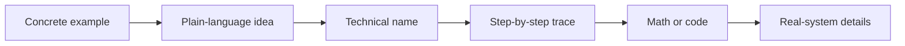

# Teaching standard

“Zero to expert” is a teaching contract. It does not mean placing an easy paragraph before an expert document. It means the reader never has to understand a term that the course has not earned yet.

## What “zero” means

The canonical course assumes:

- no machine-learning background;
- no programming experience;
- no calculus or linear algebra;
- no familiarity with research papers;
- no knowledge of terms such as token, parameter, vector, gradient, attention, or inference.

Some labs eventually use Python. The concept path explains the idea first, and the lab setup teaches what is needed to run the example.

## The required teaching order

New concepts follow this sequence:

1. **Experience it.** Begin with a concrete example the reader can follow.
2. **Explain it plainly.** State the idea without relying on its formal name.
3. **Name it.** Introduce the technical term and connect it to the example.
4. **Trace it.** Follow one input through the mechanism step by step.
5. **Formalize it.** Add notation, code, trade-offs, and production details only after the mechanism is clear.

For example, a chapter should let the reader compare a guess with a hidden answer before naming *loss*, and should explain “adjustable internal numbers” before naming *parameters*.

## First-use rule

A beginner-facing page must define a term before or in the sentence that first uses it. A link to the glossary is a backup, not a substitute for an inline explanation.

Good:

> Training changes the model's adjustable internal numbers. Those numbers are called **parameters**.

Not good:

> Backpropagation updates the parameters after computing cross-entropy loss.

The second sentence may be accurate, but it demands four unexplained ideas at once.

## One abstraction at a time

Beginner sections should avoid stacking new ideas. If a sentence introduces tokens, embeddings, vectors, attention, residual paths, and logits together, split the teaching across chapters.

Formal details are not removed. They are placed behind a clear transition such as “When you are ready for the mathematical version.” Expert readers can move quickly; new readers can keep the causal story intact.

## Analogy rule

An analogy must say where it stops working. “A model guesses the next word” is a useful beginning, but real models often predict text pieces rather than whole words. The correction should appear as soon as the reader is ready for it.

## Public-library rule

The homepage and canonical curriculum serve a general learner, not one person's interests. Advanced subjects receive prominence according to prerequisite order and broad instructional value. Role-based shortcuts are secondary overlays, never the main structure.

## Chapter review checklist

- [ ] Does the first screen use only ordinary language or immediately defined terms?
- [ ] Is there a concrete example before notation?
- [ ] Is every acronym expanded and explained at first use?
- [ ] Does each diagram use words already introduced in the surrounding text?
- [ ] Can the knowledge check be answered from this chapter and its stated prerequisites?
- [ ] Are optional expert details clearly separated from the required beginner path?
- [ ] Does an analogy disclose its limit?
- [ ] Is the chapter's place in the canonical sequence clear?
