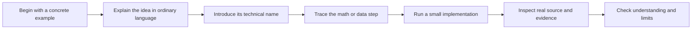

# Open LLM Engineering

## A complete, inspectable path from first principles to real systems

Open LLM Engineering is a prerequisite-free course and reference library about how language models are built, trained, evaluated, and used. It connects beginner explanations to real datasets, research papers, model implementations, training systems, and executable labs.

[Read the introduction](start-here.md){ .md-button .md-button--primary }
[Browse the curriculum](learning-paths.md){ .md-button }

## What this library is

This is an open learning library, not a guide written around one reader or one model design. Its goal is to help anyone progress from “I do not know the terminology” to being able to inspect a model release, trace how it was produced, read the relevant source code, run small versions of the mechanisms, and design a responsible project of their own.

The [Introduction](start-here.md) explains the destination before Lesson 0 begins: what you will learn, how the course teaches it, which model projects and datasets it reviews, what the labs build, and what the library does not claim.

## What you will learn

By following the complete path, you will learn to:

- trace ordinary text through data preparation, numbered text pieces, a language model, training, evaluation, and a running application;
- explain the standard Transformer design before comparing alternative designs;
- read a compact teaching implementation and find the same mechanism in production source code;
- distinguish downloadable model weights from open code, inspectable data, training records, and a reproducible release;
- examine dataset records, filtering choices, provenance, access terms, and known limitations;
- understand pretraining, instruction tuning, reasoning-oriented training, generation, serving, prompting, retrieval, tools, and agents;
- design and evaluate a small end-to-end language-model project without treating any part as magic.

You are not expected to understand those terms yet. Each one is introduced from an ordinary example before the course relies on it.

## What you will study

The library uses named projects as evidence, not as brands to memorize.

| Evidence in the library | Examples reviewed | What the examples teach |
|---|---|---|
| Model projects with substantial training records | OLMo 2, OLMo 3, OLMoE, Pythia, BLOOM, LLM360 Amber | How data, code, configurations, checkpoints, logs, and evaluations fit together—and where the record is still incomplete |
| Architecture and training case studies | Llama 3, Mixtral, DeepSeek-V3 and R1, Qwen, DBRX, Switch Transformer | How particular model components or training methods are described in released papers, configurations, weights, or source code |
| Training datasets | Common Crawl, C4, RefinedWeb, FineWeb, FineWeb-Edu, Dolma, RedPajama, SlimPajama, The Pile, ROOTS, CulturaX, The Stack v2 | How raw web, filtered text, multilingual material, mixed-domain collections, and source code become documented training inputs |
| Open-source implementations | nanoGPT, LitGPT, Hugging Face Transformers, OLMo-core, TorchTitan, Megatron-LM, TRL, vLLM, llama.cpp | How the same ideas appear in educational code, distributed training, post-training, and production serving |
| Executable companion labs | Tokenizer, attention, tiny GPT, routing layer, generation | How to run the small, readable version before inspecting a large implementation |

These releases do not all provide the same freedoms or artifacts. The course labels each case according to what is actually published instead of calling every downloadable model “open source.” See the [open-project atlas](reference/open-projects.md), [dataset reference](reference/datasets.md), and [source-code map](reference/code-map.md) for the complete evidence trails.

## How you will learn

Every major concept follows the same progression:

The mathematics is introduced only when it explains something you have already seen. The labs use tiny, project-written examples that run on a laptop. The dataset chapters show bounded record samples and published schemas; they do not silently download giant corpora. Source claims lead to original papers, official cards, configurations, logs, or repositories.

## The course journey

The detailed curriculum contains twelve ordered stages. At a high level, the journey is:

| Phase | Question answered |
|---|---|
| Introduction | What is this library, what will I learn, and what real evidence will I inspect? |
| Foundations | What are models, examples, predictions, training, numbers, and program operations? |
| Text and data | How does text become model input, and how are training collections built and governed? |
| The core model | How does a standard Transformer use earlier text to predict what comes next? |
| Training and alternatives | How is the model trained and measured, and how do alternative architectures change the computation? |
| Behavior and serving | How is a general predictor taught useful behavior and made efficient enough to run? |
| Complete systems | How do prompting, retrieval, tools, agents, safety, and release engineering fit around the model? |

[See the canonical zero-to-expert curriculum](learning-paths.md#the-canonical-zero-to-expert-course){ .md-button }

## What “open” means here

“Open model” can hide several different questions. This library keeps them separate:

| Part | Plain-language question |
|---|---|
| Learned numbers (*weights*) | Can people download, inspect, modify, and share what the model learned? |
| Blueprint (*architecture*) | Can people see the operations that turn input into output? |
| Training recipe (*code and configuration*) | Can people see how learning was run? |
| Training examples (*data*) | Can people inspect or reconstruct what the model learned from? |
| Progress snapshots (*checkpoints and logs*) | Can people study what changed during the training run? |
| Tests (*evaluations*) | Can people reproduce the reported measurements? |

The [Open Source AI Definition 1.0](https://opensource.org/ai/open-source-ai-definition) provides one formal definition. Individual software, model, and dataset licenses still determine what a person may do with each artifact.

## Begin in order

[Read the introduction](start-here.md){ .md-button .md-button--primary }
[Then begin Lesson 0](01-foundations/00-before-the-jargon.md){ .md-button }
