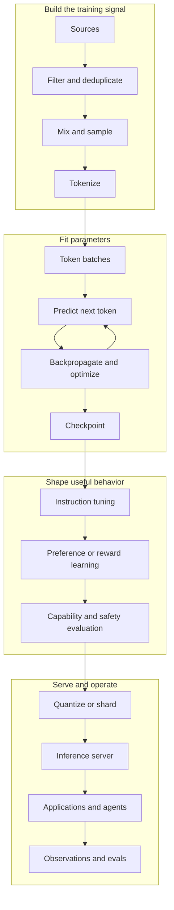

<div class="hero" markdown>

# Open LLM Engineering

## From a line of text to a distributed learning system

Language models are not mysterious boxes. They are data pipelines, numerical functions, optimization runs, and serving systems assembled at unusual scale. This book lets you follow every important transformation—and run the small version yourself.

[Start from zero](start-here.md){ .md-button .md-button--primary }
[Jump to mixture of experts](05-moe/01-why-sparse-models.md){ .md-button }

</div>

<figure markdown>
  { loading=lazy }
  <figcaption>Original generated illustration. The diagrams and chapters below provide the precise contracts behind each visual stage.</figcaption>
</figure>

## One system, seven views

<div class="signal" markdown>

<div markdown>**Data**  
What was collected, filtered, removed, mixed, and licensed?</div>

<div markdown>**Representation**  
How do bytes become token IDs and learned vectors?</div>

<div markdown>**Architecture**  
How do attention, MLPs, residual paths, and routed experts transform those vectors?</div>

<div markdown>**Learning**  
Which loss is minimized, by which optimizer, across which devices?</div>

<div markdown>**Behavior**  
How do instruction tuning, preferences, verifiers, and evaluations change outputs?</div>

<div markdown>**Inference**  
How do caches, batching, quantization, and sampling turn a checkpoint into a service?</div>

<div markdown>**Interface**  
How do prompts, retrieval, tools, memory, and agent loops constrain a probabilistic model?</div>

</div>



## The 90-second mental model

At training time, an autoregressive language model receives a sequence such as `the sky is`. The tokenizer converts it to integers. The model maps those integers to vectors, repeatedly mixes information across earlier positions with causal self-attention, transforms each position with dense or sparse feed-forward networks, and produces one score per vocabulary item. Cross-entropy makes the score for the observed next token—perhaps `blue`—more likely. Repeating that update over vast, curated corpora creates a statistical model of sequences.

At inference time, the weights are fixed. The model predicts a distribution for the next token, a decoding rule selects one token, that token joins the context, and the cycle repeats. A chat product adds templates, tools, retrieval, policy, state, and serving infrastructure around that loop.

That summary is accurate but incomplete. Every noun in it hides engineering decisions. The rest of this book opens them.

## What “open” means here

This project uses a **component ledger**, not a single open/closed label:

| Component | Question to ask |
|---|---|
| Weights | Can you download and modify the learned parameters, and under what license? |
| Architecture | Is the exact network configuration and model implementation available? |
| Training code | Can you reconstruct the optimization and distributed execution path? |
| Data | Are the corpus, source inventory, processing code, and mixture documented or available? |
| Checkpoints | Are intermediate states available for studying learning dynamics? |
| Logs and evals | Are loss curves, configuration, metrics, and evaluation code published? |

The [Open Source AI Definition 1.0](https://opensource.org/ai/open-source-ai-definition) sets a stronger standard than “downloadable weights”: the freedoms to use, study, modify, and share require access to the preferred form for making modifications, including sufficient data information, code, and parameters. Individual licenses and dataset terms still control actual use.

!!! warning "Readable is not automatically reproducible"
    A model class in an inference library can explain the forward pass without revealing the corpus, data order, optimizer state, cluster topology, or post-training procedure that produced a particular checkpoint.

## A book you can execute

The companion package deliberately keeps scale tiny while preserving the contracts that matter:

```python
from open_llm_lab.model import TinyGPT, TinyGPTConfig

model = TinyGPT(TinyGPTConfig(vocab_size=256, d_model=64, n_heads=4, n_layers=2))
```

You can inspect causal attention, watch a router assign tokens to experts, train on a small local string, and test generation deterministically. Each lab points back to production codebases so you can compare the teaching implementation with real systems.

## Choose your route

- **New to machine learning:** [Foundations → tokens → attention](learning-paths.md#the-builder-from-zero)
- **Software engineer:** [Code-first route](learning-paths.md#the-code-first-engineer)
- **ML practitioner:** [Data, scaling, MoE, and serving](learning-paths.md#the-ml-practitioner)
- **Decision maker:** [System map, openness, risk, and cost](learning-paths.md#the-technical-leader)
- **Research reader:** [Equations, papers, source trails, and replication](learning-paths.md#the-research-track)
