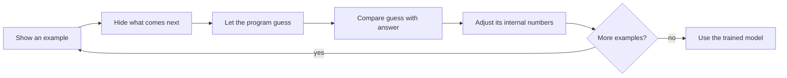

# Open LLM Engineering

## Learn how language models work, one idea at a time

No machine-learning background is required. Begin with a familiar guessing game, then build—carefully and in order—toward the real examples, source code, mathematics, many-computer learning systems, and production engineering behind modern language models.

[Begin with lesson 0](01-foundations/00-before-the-jargon.md){ .md-button .md-button--primary }
[See the full curriculum](learning-paths.md){ .md-button }

## Start with one ordinary question

Complete this sentence:

> The cat sat on the ___

You might think of `mat`, `floor`, or `chair`. You can do that because you have seen language before and learned which words tend to fit together.

A **language model** is a computer program trained to do a related job. Given some text, it assigns each possible continuation a score. A higher score means “this continuation looks more likely based on the examples I learned from.” The model then selects one continuation and repeats the process.

That one loop is the starting point for everything in this library.

!!! note "Illustration, not a measurement"
    If this page shows one ending as more likely than another, it is explaining the idea. It is not reporting output from a named model.

## How the program learns

Before training, its guesses are poor. Training repeats a simple cycle over many examples:

The **internal numbers** are settings the program can change while learning. Later you will learn their technical name—*parameters*—and see exactly how they are adjusted. For now, the important idea is simply:

> examples → guess → compare → adjust → repeat

## The path from zero to expert

The course follows one canonical order. Each stage depends only on ideas taught earlier.

| Stage | The plain-language question |
|---:|---|
| 0 | What are a model, an example, a prediction, and training? |
| 1 | How does a computer turn text into manageable pieces? |
| 2 | How can adjustable numbers capture patterns from examples? |
| 3 | How can each text piece use information from earlier pieces? |
| 4 | How are those operations assembled into a complete language model? |
| 5 | How can the same basic model be trained across many computers? |
| 6 | How is a general text predictor taught to follow instructions? |
| 7 | How is a trained model made fast, measurable, and safe enough to use? |
| 8 | How do retrieval, tools, and agent loops turn a model into a larger system? |

[Follow the canonical curriculum](learning-paths.md#the-canonical-zero-to-expert-course){ .md-button }

Advanced designs that send different text pieces through different internal paths appear only after the standard, same-path model has been explained.

## Technical names you will earn along the way

The library uses precise terms, but never as a substitute for explanation:

**Training data** 
The examples used for learning.

**Tokens** 
The numbered text pieces a model processes.

**Parameters** 
The adjustable internal numbers changed during training.

**Transformer** 
A model design that lets text positions exchange useful information.

**Inference** 
Using a trained model without changing its learned numbers.

**Evaluation** 
Testing what the complete system does well and where it fails.

You do not need to memorize that list. Each term is reintroduced with a worked example in the chapter where it becomes useful.

## What “open” means here

“Open model” can hide several different questions. This library keeps the pieces separate:

| Part | Plain-language question |
|---|---|
| Learned numbers (*weights*) | Can people download, inspect, modify, and share what the model learned? |
| Blueprint (*architecture*) | Can people see the operations that turn input into output? |
| Training recipe (*code and configuration*) | Can people see how learning was run? |
| Training examples (*data*) | Can people inspect or reconstruct what the model learned from? |
| Progress snapshots (*checkpoints and logs*) | Can people study what changed during the training run? |
| Tests (*evaluations*) | Can people reproduce the reported measurements? |

The [Open Source AI Definition 1.0](https://opensource.org/ai/open-source-ai-definition) provides one formal definition. Individual code, model, and dataset licenses still determine what a person may actually do with each artifact.

## Learn by running the small version

The companion labs use tiny examples that run on a laptop. You will train a text-piece builder, inspect how earlier words affect later ones, fit a small language model, observe an advanced routing layer, and compare generation choices. The examples are small enough to read line by line and are tested automatically.

[Read the orientation](start-here.md){ .md-button .md-button--primary }
[Set up the labs](labs/setup.md){ .md-button }
