# The canonical zero-to-expert course

This library has one main route. It does not assume that you already know machine learning, programming, or the language researchers use.

In this book, a **language model** is a program that learns patterns from examples of text. If that sentence makes sense, you are ready to begin. The first lesson introduces every other essential term with ordinary examples before later chapters use it.

## The one path through the library

Follow these stages in order on your first pass. Each stage builds on the one before it.

```mermaid
flowchart LR
    A[Start with ordinary language] --> B[Turn text into pieces]
    B --> C[Prepare examples]
    C --> D[Understand the model's calculations]
    D --> E[Teach and test a model]
    E --> F[Compare different designs]
    F --> G[Teach useful behavior]
    G --> H[Run the finished model]
    H --> I[Give clear instructions]
    I --> J[Connect tools safely]
    J --> K[Design a complete project]
```

Do not worry about memorizing everything. At each exit check, explain the idea in your own words or complete the small task. If you cannot yet do that, revisit the linked lesson before moving on.

## Stage 0 — Learn the words before the machinery

**You already know:** how to read a short paragraph and recognize that a prediction can be right or wrong.

**You will learn:** what people mean by model, training, input, output, parameter, token, context, and inference. You will also see the difference between the learning process, the learned model, and an application built around that model.

**Read:** [Before the jargon](01-foundations/00-before-the-jargon.md), then [What an LLM is](01-foundations/01-what-is-an-llm.md).

**Exit check:** Explain to a friend, without using technical terms, the difference between teaching a model with examples and using the finished model to continue a sentence.

## Stage 1 — Build the foundation

**You already know:** the vocabulary from Stage 0 and the basic difference between training and using a model.

**You will learn:** how a model improves from examples; how lists and grids of numbers carry information; and enough Python plus a Python library called PyTorch to read the teaching code. The math chapter begins with shapes and arithmetic, not calculus.

**Read:** [Learning from examples](01-foundations/02-learning-from-data.md), [Math with shapes](01-foundations/03-math-with-shapes.md), and [The PyTorch mental model](01-foundations/04-pytorch-mental-model.md).

**Exit check:** Given a grid with 3 rows and 4 columns, state its shape, identify one value by row and column, and explain why a program must keep track of those dimensions.

## Stage 2 — Turn text into model input

**You already know:** what a model, training example, number grid, and shape are.

**You will learn:** why a model receives numbered text pieces instead of raw sentences; how a vocabulary maps pieces to numbers; how a common vocabulary-building method works by hand; and what changes when pieces are larger or smaller.

**Read and do:** [Text becomes tokens](02-tokenization/01-text-becomes-tokens.md), [BPE by hand](02-tokenization/02-bpe-by-hand.md), [Vocabulary trade-offs](02-tokenization/03-vocabulary-tradeoffs.md), [Tokenizer engineering](02-tokenization/04-tokenizer-engineering.md), and the [tokenizer lab](labs/01-tokenizer.md).

**Exit check:** Break a short sentence into text pieces, assign each piece a number, and reconstruct the sentence from the numbers. Explain why two models may split the same sentence differently.

## Stage 3 — Build responsible training data

**You already know:** how text becomes numbered input and how examples can change a model.

**You will learn:** where open training text comes from; how records are stored; how teams remove duplicates, low-quality material, and sensitive content; and how licenses and documentation constrain use.

**Read and do:** [Data is the model](03-data/01-data-is-the-model.md), [Open dataset atlas](03-data/02-open-dataset-atlas.md), [The curation pipeline](03-data/03-curation-pipeline.md), [Governance and licensing](03-data/04-governance-licensing.md), and [Build a small corpus](03-data/05-build-a-small-corpus.md).

**Exit check:** Take five sample documents and write a simple keep-or-remove rule for duplicates, private information, and unusable text. Record where each kept document came from and what its license allows.

## Stage 4 — Understand the main model design

**You already know:** numbered text pieces, shapes, simple PyTorch operations, and what makes a usable training example.

**You will learn:** how numbered pieces become learned representations; how the model mixes information from earlier positions; how the same calculation path processes every piece; and how repeated blocks produce a next-piece prediction. This standard, same-path design is called a **dense Transformer** here. The chapters introduce each named part one at a time before combining them; you do not need to know those names yet.

**Read and do:** [The Transformer mental model](04-transformer/01-transformer-mental-model.md), [Embeddings and position](04-transformer/02-embeddings-and-position.md), [Attention from scratch](04-transformer/03-attention-from-scratch.md), [The Transformer block](04-transformer/04-the-transformer-block.md), [Modern block variants](04-transformer/05-modern-block-variants.md), the [attention lab](labs/02-attention.md), and the [tiny GPT lab](labs/03-tiny-gpt.md).

**Exit check:** Trace one text piece from its input number to a score for every possible next piece. At each step, name what information is added or transformed. Then run the tiny model and confirm that its output dimensions match the lab explanation.

## Stage 5 — Train and evaluate the model

**You already know:** the full calculation performed by a small dense Transformer and how training text is prepared.

**You will learn:** how predicting the next text piece creates a training signal; how the model's adjustable numbers are updated; why learning rate, batch size, data volume, and model size matter; how work is divided across computers; and how checkpoints and evaluations reveal progress or failure.

**Read:** [The pretraining objective](06-training/01-pretraining-objective.md), [Optimization and scaling](06-training/02-optimization-and-scaling.md), [Distributed training](06-training/03-distributed-training.md), and [Evaluation and checkpoints](06-training/04-evaluation-and-checkpoints.md).

**Exit check:** Describe one complete training step from a batch of text to updated model parameters. Choose one change to test, keep the other conditions fixed, and state what measurement would show whether the change helped.

## Stage 6 — Compare model designs

**You already know:** the parts of a dense Transformer, the ordinary feed-forward layer inside each block, and the training process used to adjust it.

**You will learn:** why some models replace one feed-forward path with several specialist paths; how a small routing calculation selects a limited number of those paths for each text piece; how the selected results are combined; and why capacity, balance, communication, and total-versus-active parameter counts matter. This design is called a **mixture of experts (MoE)**. It is one architecture choice, not a shortcut around the dense Transformer.

**Read and do:** [Why sparse models](05-moe/01-why-sparse-models.md), [Router math](05-moe/02-router-math.md), [Capacity and load balancing](05-moe/03-capacity-load-balancing.md), [Distributed expert parallelism](05-moe/04-distributed-expert-parallelism.md), [Real architectures](05-moe/05-real-architectures.md), [Prompting and experts](05-moe/06-prompting-and-experts.md), [Build a tiny MoE](05-moe/07-build-a-tiny-moe.md), and the [tiny MoE lab](labs/04-tiny-moe.md).

**Exit check:** Starting from the feed-forward layer you studied in Stage 4, draw how one input is sent through a dense model and an MoE model. State what extra decision the MoE model makes, what it may save, and what new problems it creates.

## Stage 7 — Teach the pretrained model useful behavior

**You already know:** how a model learns to continue text, how its architecture performs the calculation, and how its progress is evaluated.

**You will learn:** why next-piece prediction alone does not create a reliable assistant; how demonstrations, preference comparisons, human feedback, automated checks, and reasoning-focused training change behavior; and what each method can and cannot guarantee.

**Read:** [Supervised and instruction tuning](07-post-training/01-sft-and-instruction-tuning.md), [Preference optimization](07-post-training/02-preference-optimization.md), [RLHF and verifiers](07-post-training/03-rlhf-and-verifiers.md), and [Reasoning models](07-post-training/04-reasoning-models.md).

**Exit check:** Given a pretrained text-completion model, propose examples that teach it to answer an instruction and comparison data that teaches it which of two answers is better. Explain why passing that test does not prove the model is always safe or correct.

## Stage 8 — Generate and serve answers

**You already know:** what the finished model computes and how pretraining and post-training shaped it.

**You will learn:** how scores become selected output pieces; how generation reuses previous calculations; how servers combine requests efficiently; and how reduced precision and draft-and-check methods trade memory, speed, and quality.

**Read and do:** [Decoding](08-inference/01-decoding.md), [The KV cache](08-inference/02-kv-cache-and-attention.md), [Serving and batching](08-inference/03-serving-and-batching.md), [Quantization and speculative decoding](08-inference/04-quantization-speculation.md), and the [generation lab](labs/05-generation.md).

**Exit check:** Trace the generation of two new text pieces, including how each is selected and what earlier work can be reused. Then explain one quality-versus-speed choice in plain language.

## Stage 9 — Communicate with the model

**You already know:** how training shapes behavior and how the model generates an answer from instructions and prior text.

**You will learn:** how to make a request clear; when to require a structure; how tools, retrieved documents, and long inputs change the task; and how to test prompts instead of relying on anecdotes.

**Read:** [Prompting as interface design](09-prompting/01-prompting-as-interface.md), [Structured output and tool use](09-prompting/02-structured-and-tool-use.md), [Long context and RAG](09-prompting/03-long-context-rag.md), and [Reasoning and evaluation](09-prompting/04-reasoning-and-evaluation.md).

**Exit check:** Write a prompt with a clear task, necessary context, constraints, and output format. Create three test cases, including one difficult case, and define what a successful answer must contain.

## Stage 10 — Build systems that can take actions

**You already know:** how to request structured output, connect a model to a tool, and evaluate the result.

**You will learn:** how an application can repeatedly observe, decide, call tools, and check results; how memory and planning fit around the model; how multiple model-driven workers can coordinate; and where permissions, validation, logs, limits, and human approval are required.

**Read:** [The agent loop](10-agents/01-agent-loop.md), [Memory, planning, and multiple agents](10-agents/02-memory-planning-multi-agent.md), and [Production safety](10-agents/03-production-safety.md).

**Exit check:** Design a small tool-using system on paper. Mark its input, model decision, allowed action, result check, stop condition, and the point where a person must approve a risky action.

## Stage 11 — Design an end-to-end project

**You already know:** the complete path from raw text through training, architecture, behavior tuning, generation, prompting, and tool use.

**You will learn:** how the choices constrain one another; how to choose a model and data plan; how to estimate compute; how to train, evaluate, document, and release responsibly; and how to make the result reproducible by someone else.

**Read:** [The complete pipeline](11-end-to-end/01-complete-pipeline.md), [Design a model](11-end-to-end/02-design-a-model.md), [Plan data and compute](11-end-to-end/03-plan-data-compute.md), [Train, evaluate, and release](11-end-to-end/04-train-evaluate-release.md), and [The reproducibility blueprint](11-end-to-end/05-reproducibility-blueprint.md).

**Exit check:** Produce a one-page design for a small language-model project. Specify its purpose, data sources and permissions, model design, training objective, evaluation plan, hardware assumptions, release artifacts, known risks, and reproduction instructions.

Completing Stage 11 does not mean that learning is finished. It means you now have the shared foundation needed to read source code and papers, reproduce claims, and specialize without treating the system as a black box.

## Optional accelerators after the shared foundation

These are overlays, not substitute starting points. Complete the listed canonical stage first, then use an accelerator to spend more time on the material that matches your work.

| If you want to… | Complete first | Add this emphasis |
|---|---:|---|
| Build and debug model code | Stage 4 | Run every [lab](labs/setup.md), compare the teaching implementations with the [source-code map](reference/code-map.md), and trace dimensions at every operation. |
| Curate or govern data | Stage 3 | Study the [dataset catalog](reference/datasets.md), follow source and license records through a small curation run, and write a dataset card. |
| Train models across several computers | Stage 5 | Revisit distributed training with the [equation sheet](reference/equations.md), estimate memory and communication costs, and reproduce a small scaling measurement. |
| Serve models in products | Stage 8 | Benchmark generation speed and memory, inspect a production serving implementation in the [source-code map](reference/code-map.md), and test failure behavior under concurrent requests. |
| Conduct research | Stage 6 | Follow the original work in the [paper trail](reference/papers.md), inspect pinned source revisions, and turn one claim into a controlled experiment with a baseline and repeated runs. |
| Evaluate technical or business claims | Stage 8 | Use the [myth detector](reference/myth-detector.md) and [open-project catalog](reference/open-projects.md) to separate released artifacts, measured evidence, license rights, costs, and missing information. |

## How depth is marked

Chapters use four informal labels:

- **Foundation** — begins from everyday examples and defines new terms.
- **Builder** — uses basic Python and arithmetic introduced earlier in the path.
- **Engineer** — reasons about dimensions, memory, performance, and implementation behavior.
- **Research** — reads papers, designs controlled experiments, and studies multi-computer systems.

On a first pass, it is fine to skip a clearly marked research subsection. The next foundation or builder subsection should remain understandable. Keep the [glossary](reference/glossary.md) nearby, and return to the most recent exit check whenever a later chapter feels too abrupt.
