# Introduction: what this library will teach you

This library explains how a **large language model**—a program that learns
patterns from text examples—can continue a sentence, answer a question, write
code, or call a tool. It begins with no assumed knowledge. You do not need to
know machine learning, programming, or advanced mathematics before you start.

Before the first lesson, this introduction shows you the destination: what you
will learn, how you will learn it, which public projects and **datasets**
(organized collections of examples) you will inspect, and what this library
cannot honestly promise.

## The goal

The goal is not to give you a list of fashionable terms. It is to help you build
an accurate, connected understanding of the whole system.

In this library, **training** means changing a program by showing it examples
and using its mistakes to guide small adjustments.

By the end of the main course, you should be able to:

- explain in ordinary language how a language model learns from examples;
- trace text from its original form to the pieces a model processes and then to
  the generated answer;
- explain the main parts of a Transformer, the model design used by most modern
  language models;
- describe how data is collected, cleaned, documented, combined, and checked;
- read a small training program and connect its operations to the ideas in the
  lessons;
- explain how training changes a model and how a trained model produces text;
- compare a standard model with a **mixture-of-experts model**, a later design
  that sends each text piece through only some of several available internal
  paths;
- distinguish initial training from later training that teaches instruction
  following, preferences, tool use, or safer behavior;
- evaluate **prompts**—the instructions or questions given to a model—along
  with model answers, speed, memory use, and failure cases;
- follow a claim back to released code, data documentation, model
  documentation, research papers, saved training states, and evaluation
  results; and
- design a small end-to-end language-model project with a defensible data,
  training, evaluation, and release plan.

The [canonical curriculum](learning-paths.md) turns these outcomes into an
ordered sequence with a knowledge check at the end of every stage.

## Who this is for

This library is for anyone who wants to understand language models rather than
treat them as mysterious services. A complete beginner can follow it in order.
A software engineer, data practitioner, researcher, product builder, or
technical decision-maker can move more quickly through familiar material and
use the same source trails for deeper study.

The shared course is not organized around one job or one model family. Everyone
first earns the same foundation. Optional specializations come later.

## How the journey is organized

The course follows the order in which the ideas depend on one another:

```mermaid
flowchart LR
    A[Begin with an everyday prediction] --> B[Turn text into processable pieces]
    B --> C[Inspect and prepare real data]
    C --> D[Build the standard model]
    D --> E[Train and evaluate it]
    E --> F[Compare alternative model designs]
    F --> G[Teach useful response behavior]
    G --> H[Generate and serve answers]
    H --> I[Use prompts and tools]
    I --> J[Design a complete project]
```

You begin by playing a next-word prediction game. Only after the behavior is
familiar does the course introduce the technical name for it. You then learn
how text becomes smaller pieces, how examples become training data, how a
standard Transformer processes those pieces, and how training adjusts the
model. Alternative designs such as mixture of experts appear only after the
standard design is clear.

Later stages cover improving behavior after initial training, producing answers
efficiently, writing reliable prompts, connecting models to tools, and
evaluating complete systems. The final stages bring those parts together into a
reproducible project plan. The [concept ladder](reference/concept-ladder.md)
shows where each important term is introduced for the first time.

## How each idea is taught

New ideas follow the same sequence throughout the library:

1. **Experience it.** Start with a small example you can follow without special
   vocabulary.
2. **Explain it.** Describe what happened in ordinary language.
3. **Name it.** Introduce the technical term and define it immediately.
4. **Trace it.** Follow one input through the process step by step.
5. **Formalize it.** Add diagrams, code, mathematics, trade-offs, and real-system
   details after the mechanism is understandable.
6. **Test it.** Answer a knowledge check, run a small experiment, or examine a
   real released artifact.

This order is the project's [teaching standard](about/teaching-standard.md).
Mathematics and production engineering are not removed; they are introduced
when the reader has a reason to use them.

## The real evidence you will inspect

The lessons do not rely only on simplified explanations. They connect those
explanations to public evidence, including:

- actual rows and published field layouts from datasets;
- data-collection, filtering, duplicate-removal, and mixing code;
- **dataset cards**, which are publisher documents describing a dataset's
  contents, creation, intended uses, limits, and terms;
- **model cards**, which are publisher documents describing a released model,
  its intended uses, evaluations, and known limits;
- model and training **source code**, the human-readable instructions that make
  the programs work;
- training settings, **logs** (records made while training), and
  **checkpoints**, which are saved states from points during training;
- evaluation programs, prompts, and reported results; and
- original research papers and official technical reports.

You will learn to separate what a source directly publishes from what can be
calculated, reasonably inferred, or is still unknown. The
[research methodology](about/methodology.md) explains the evidence rules, and
the [source-code map](reference/code-map.md) links each major idea to compact
teaching code and larger real implementations.

## Models and public projects reviewed

No single project releases every part of the record. The library therefore uses
different projects to answer different questions.

### End-to-end research case studies

These projects are useful because they publish more than a final set of
**parameters**, the adjustable internal numbers changed during training:

| Project family | What you will study |
|---|---|
| **OLMo 2 and OLMo 3** | The connection among published combinations of datasets, training code, saved states, records made during training, evaluations, and several stages of model development. |
| **OLMoE** | A research example of mixture-of-experts training with unusually broad public artifacts. |
| **Pythia** | How models of several sizes change during training, using many saved points from controlled runs. |
| **BLOOM** | A large multilingual model built through an open research collaboration, with the ROOTS data trail and saved information from points during training. |
| **LLM360 Amber** | Ordered training data, training settings, measurements, and hundreds of saved training states. |
| **OpenLLaMA and RedPajama-INCITE** | Attempts to build Llama-style models from publicly described data mixtures and training recipes, with important reproducibility limits to inspect. |

### Model-design and source-code case studies

The course also compares released implementations and published designs from
**Llama 3**, **Mistral and Mixtral**, **DeepSeek-V3 and DeepSeek-R1**, **Qwen**,
and **DBRX**. These families help explain how repeated model sections work, how
a model decides which earlier text pieces matter, how it represents order, how
mixture-of-experts routing differs, and how later training can improve behavior
on difficult problems. A family may publish trained parameters and code for
running the trained model without publishing its exact training data or full
training system, so it is not automatically an end-to-end reproducible project.

For readable implementations, the library uses **nanoGPT**,
**build-nanogpt**, **LitGPT**, **minbpe**, and **llm.c**. For larger training
systems, it follows **OLMo-core**, **TorchTitan**, and **Megatron-LM**. The
[open-project atlas](reference/open-projects.md) records why each project is
useful and what remains missing.

## Datasets reviewed

The data chapters examine both the content and the path that turns raw material
into model-ready examples.

| Data category | Datasets and sources reviewed | What they teach |
|---|---|---|
| Raw web archives | **Common Crawl** | Why a public web archive is not yet clean or approved training data. |
| Filtered English web | **C4**, **RefinedWeb**, **FineWeb**, **FineWeb-Edu** | How filtering choices, quality scoring, traceable source fields, and reproducible processing change a collection. |
| Mixed-domain English | **Dolma v1**, **Dolma 3**, **RedPajama v1 and v2**, **SlimPajama**, **The Pile** | How web pages, papers, books, code, reference works, and other sources are combined; how versions and duplicate removal matter. |
| Multilingual text | **ROOTS**, **CulturaX**, and multilingual **RedPajama v2** | How language coverage, rules for choosing and managing sources, and uneven data quality complicate a large collection. |
| Source code | **The Stack v2** | How recorded origins, file licenses, required credit, removals, and separate content access affect a code dataset. |

The course also follows specific model-to-data relationships: OLMo to Dolma,
Pythia to The Pile, BLOOM to ROOTS, OpenLLaMA and RedPajama-INCITE to
RedPajama, and Amber to AmberDatasets. The
[dataset catalog](reference/datasets.md) provides sizes, access methods,
published field layouts, terms caveats, code for reading small samples, and
primary links.

“Publicly downloadable” does not automatically mean “openly licensed for every
use.” The data chapters teach you to inspect the database terms, the rights in
the individual works, privacy and safety risks, and the exact version used by a
model.

## Labs and source walkthroughs

Five small labs let you run the central mechanisms on an ordinary computer:

1. create a **tokenizer**, a program that turns text into smaller pieces;
2. run **attention**, the process that lets each text position use information
   from earlier positions;
3. assemble and train a tiny standard Transformer language model;
4. route text pieces through a tiny mixture-of-experts layer; and
5. generate text one piece at a time.

The labs are deliberately small, use the computer's main processor by default,
and learn from tiny inputs written for this project. They do not silently
download any of the datasets above, outside model code, or trained parameters.
Tests check the behavior each lesson claims to teach. See [lab setup](labs/setup.md)
for the exact environment and sequence.

Source walkthroughs pair the small teaching implementation with a released
real implementation. You first trace the shorter version, then locate the same
responsibility inside a larger codebase. The course explains outside code in
original words and links to the full upstream file rather than copying large
sections of it.

## Scope and honest limitations

This is an explanation and engineering library built from public evidence. It
is not inside information about proprietary systems, legal advice, or a promise
that every published model can be reproduced exactly or affordably.

In particular:

- downloadable model parameters—often called **weights**—do not prove that
  training code, exact data, logs, or redistribution rights are also open;
- a published recipe may be enough to build a similar model without being
  enough to recreate identical parameters;
- dataset availability, licenses, repository contents, and model cards can
  change, so important experiments must record exact versions;
- the laptop-sized labs demonstrate mechanisms, not the cost, reliability, or
  coordination problems of training a very large model across many computers;
- results from standard tests, often called **benchmarks**, are not
  automatically comparable when prompts, answer scoring, model versions, or
  evaluation programs differ;
- the library does not guess undisclosed training data from a model's answers;
  and
- prompting a mixture-of-experts model does not give the user direct control of
  its internal routing unless the model exposes such a control.

The aim is not to make every unknown disappear. It is to teach you how to
recognize what is known, find the evidence, test the mechanism, and label what
remains uncertain.

## Begin the course

Continue to [Lesson 0: Before the jargon](01-foundations/00-before-the-jargon.md).
It begins with one ordinary prediction game and introduces only the words you
need for the next step. Keep the [glossary](reference/glossary.md) nearby as a
backup, and use the [canonical curriculum](learning-paths.md) as your map.
