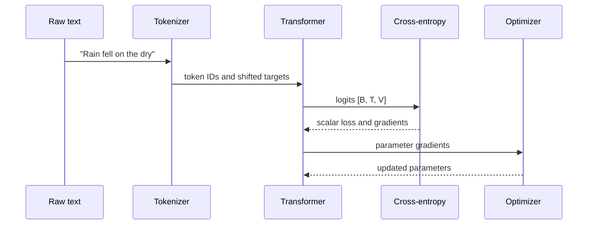

# Start here

You do not need calculus, a GPU cluster, or prior ML experience to begin. You do need to keep three ideas separate:

1. **The training process** changes parameters by comparing predictions with examples.
2. **The trained model** is a numerical function plus learned parameters.
3. **The product** wraps that model with templates, retrieval, tools, policies, storage, and infrastructure.

Confusing these layers causes most bad explanations of LLM behavior.

## Your first complete trace

Suppose the text is:

> Rain fell on the dry

A simplified tokenizer might produce `[4210, 981, 319, 279, 5421]`. During training, one input/target view is:

| Position | Context visible to the model | Target |
|---:|---|---|
| 0 | `Rain` | ` fell` |
| 1 | `Rain fell` | ` on` |
| 2 | `Rain fell on` | ` the` |
| 3 | `Rain fell on the` | ` dry` |

All four predictions can be computed in parallel because a **causal mask** prevents each position from looking rightward. The model returns logits with shape `[batch, sequence, vocabulary]`. A softmax converts one logit vector to probabilities; cross-entropy penalizes the probability placed on the observed target. Backpropagation computes how each parameter contributed to that penalty, and the optimizer nudges the parameters.

At inference time there are no target tokens and no optimizer. The system selects a token from the final-position distribution, appends it, and runs again—usually reusing the **KV cache** so earlier attention keys and values do not need to be recomputed.

## The four levels used in every chapter

=== "Intuition"

    A durable mental model and one concrete example.

=== "Mechanism"

    Tensor shapes, equations, invariants, and a trace.

=== "Implementation"

    Executable teaching code plus links to production source.

=== "Limits"

    What the explanation does not imply, common failure modes, and unresolved research questions.

## Before copying a recipe

Ask:

- Is this a fact from a specific implementation, a result from an experiment, or a rule of thumb?
- Which model, tokenizer, dataset version, hardware, and software revision does it describe?
- Does “tokens” mean raw corpus tokens, retained training tokens, or tokens actually consumed after sampling?
- Does “parameters” include inactive experts, embeddings, shared experts, and tied weights?
- Does a benchmark measure the property the surrounding sentence claims?
- Are the model, code, and data licenses compatible with the intended use?

## Suggested first session

1. Read [What an LLM is](01-foundations/01-what-is-an-llm.md).
2. Work through [Text becomes tokens](02-tokenization/01-text-becomes-tokens.md).
3. Run the [tokenizer lab](labs/01-tokenizer.md).
4. Read the [Transformer mental model](04-transformer/01-transformer-mental-model.md).
5. Return to the [complete pipeline](11-end-to-end/01-complete-pipeline.md) whenever you lose the big picture.

!!! tip "Read equations as programs"
    Name every input, write its shape, follow one index, and check the output shape. The [math chapter](01-foundations/03-math-with-shapes.md) teaches this method without assuming advanced mathematics.
