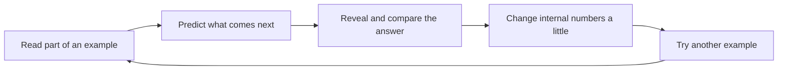

# Start here: your first five minutes

This library assumes no prior study of artificial intelligence, programming, calculus, or statistics. If a chapter introduces a technical word, it must first explain the ordinary idea that the word names.

## The first idea

Try to complete this phrase:

> Peanut butter and ___

Many English speakers will think of `jelly`. That answer is not guaranteed, but it is a strong pattern in the language examples they have encountered.

A computer can learn patterns from examples too. We call the learned program a **model**.

- The text given to it is the **input**.
- What it produces is the **output**.
- A possible output chosen before the answer is known is a **prediction**.
- Showing it examples and adjusting it when its predictions are poor is **training**.

Those four ideas are enough to begin.

## One complete learning cycle

Imagine these examples:

```text
The dog chased the ball.
Please open the door.
Rain fell on the ground.
```

During one kind of training, the program sees the beginning and tries to predict what comes next:

| Given to the program | Hidden answer |
|---|---|
| `The dog chased the` | `ball` |
| `Please open the` | `door` |
| `Rain fell on the` | `ground` |

The program guesses, compares its guess with the hidden answer, and changes some of its internal numbers. It repeats that process across many examples.



The technical name for an adjustable internal number is a **parameter**. A real language model can contain a very large number of parameters, but the learning idea remains the same.

## Training and using are different

During **training**, the program changes its parameters as it studies examples.

After training, people can give it new input and ask for an output without changing those parameters. That second activity is called **inference**, which simply means “use the trained model to make a prediction.”

| Activity | Are the learned numbers changing? | Purpose |
|---|:---:|---|
| Training | Yes | Learn patterns from examples |
| Inference | No | Use those patterns on new input |

## Why text must become pieces

Computers operate on numbers. Before a language model can process text, another part of the system divides text into reusable pieces and gives each piece a number. A piece is called a **token**.

For example, one tokenizer might split:

```text
unbelievable → un + believ + able
```

A **tokenizer** is the component that performs that conversion. Different tokenizers can choose different pieces. You will build a small one later; for now, remember only that a token is a numbered text piece, not necessarily a whole word.

## Six words to take with you

| Word | Meaning in this course |
|---|---|
| Model | A program whose behavior was shaped by examples |
| Input | What goes into the program |
| Output | What comes out |
| Prediction | A possible output selected by the model |
| Training | Adjusting internal numbers using examples |
| Token | A numbered piece of text |

Every later term will be built from ideas like these.

## Quick check

1. What is the difference between training and inference?
2. Is a token always a word?
3. What changes when a model learns from an example?

<details><summary>Answers</summary>

1. Training changes the model's adjustable numbers; inference uses the learned numbers without changing them.
2. No. A token can be a word, part of a word, punctuation, a byte, or another text unit chosen by the tokenizer.
3. Some of its adjustable internal numbers—its parameters—change a little.

</details>

## The recommended first session

Follow these in order:

1. [Before the jargon](01-foundations/00-before-the-jargon.md) — practice the core ideas with no assumed background.
2. [What an LLM is](01-foundations/01-what-is-an-llm.md) — connect those ideas to a language model.
3. [Learning from examples](01-foundations/02-learning-from-data.md) — see how repeated correction becomes training.
4. [Text becomes tokens](02-tokenization/01-text-becomes-tokens.md) — understand the text-to-number bridge.
5. [Tokenizer lab](labs/01-tokenizer.md) — run the first small implementation.

Then continue through the [canonical zero-to-expert curriculum](learning-paths.md#the-canonical-zero-to-expert-course).

!!! tip "You never need to guess what a symbol means"
    The mathematics chapters name every symbol and show its shape. Skip a formal section on the first pass if needed; the surrounding explanation will tell you when to return.
